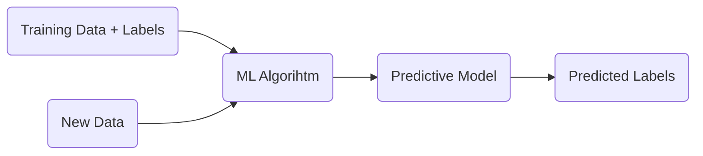

# 1 Giving Computers the Ability to Learn from Data

3 types of machine learning:

- Supervised learning
- Unsupervised learning
- Reinforcement learning

## Supervised Learning

- Data is labeled, the goal is to use the labels as feedback in the
  training phase of the model. This way, it can made predictions about
  unseen data.

- Train the model with examples.

- Model the relationships between the data inputs and the labels.

- Main tasks
  - Classification: assign discrete outcomes to data. For example: say if an email is spam or not.
  - Regression: give a continuous outcome based on exploratory labels. For example: predict next year harvest based on past years data.

## Unsupervised Learning

- Unlabeled data. Unknown structure.
- No labels. No reward function.

## Reinforcement Learning

- Goal: develop an agent that improves its performance based on iterations with the environment(context).
- Take the environment's state and use a reward function to say how good or bad was the model's action.
- Trial and error approach.
- Choosing a series of action that maximizes the total reward.
